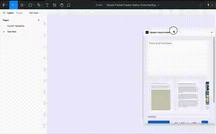

# 📚 EbookFrameCreator Plugin



## Overview
EbookFrameCreator is in its infancy—think of it as version 0.1.6, more like a newborn baby I'm nurturing day by day. There's a story behind it. I found myself working alongside a team with a huge task: creating 100 ebooks using ChatGPT. I thought, there's got to be a way to make this easier.

💡 A lightbulb went off, and I started piecing together the EbookFrameCreator plugin. It's designed to snugly fit into Figma because, let's face it, we all love how easy Figma makes design work, right? But this plugin? It's a game-changer. It turns what used to be a daunting task into something you can breeze through, boosting productivity like nobody's business by smoothing out and speeding up the whole ebook creation flow.

I didn't just make it for a single team. Seeing how much it helped them, it felt right to share it with everyone. It's my way of throwing a little help out into the world for anyone bogged down with design work. I'm all about sharing the love, making sure creative folks have what they need to make their projects a little less stressful and a lot more fun. Yeah, that's the scoop on my little project. Can't wait to see how it grows and helps even more people down the line!

## 🛠️ Version History

### Version 6 - March 15, 2024
- 🐞 Fixed minor bugs and added RTL as a demo. It’s not fully functional yet.

### Version 5 - February 15, 2024
- 🖼️ Added an image carousel for faster marker addition. Just paste the result from ChatGPT and click on the type of page you like.

### Version 4 - February 14, 2024
- 📜 Follow the instructions from release note 3 and use the provided markdown templates. Currently, there are limitations as we are in beta production.

#### Markdown Templates:
- **Headers**
  - Example: `**Part I: Understanding the Fundamentals of Branding**`
- **Ordered Lists for Headers**
  - Example:
    ```
    1. **The Essence of Branding**
    2. **The Importance of Branding in Business**
    ```
- **Unordered Lists**
  - Example: 
    ```
    - Introduction to Branding: The Critical Role in Business Success
    - Why This Book? Bridging the Gap for Business Professionals
    ```
- **Nested Lists**
  - Example: 
    ```
    1. **The Essence of Branding**
       - What is a Brand?
       - The Evolution of Branding
    ```
- **Bold Text**
  - Example: `**Brand Strategy:**`
- **Bullets with Bold Text and Colon**
  - Example:
    ```
    - **Brand Strategy Checklist:**
      - Define your brand's target audience.
      - Identify your brand's unique selling proposition (USP).
    ```
- **Text After Bullets with Colon**
  - Example:
    ```
    - *Logo:* Your logo should be unique and easily recognizable. It's the visual representation of your brand.
    - *Color Palette:* Choose colors that reflect your brand's personality. This includes primary and secondary colors for consistency across all media.
    ```

### Version 3 - February 12, 2024
- 📝 Introduced page templates for various content types. Use these before each page's contents:

  ```
  #>page-intro<#
  #>page-simpletext<#
  #>page-image-desc<#
  #>page-bullet<#
  #>page-two-column-1<#
  #>page-two-column-2<#
  #>page-two-column-3<#
  #>page-two-column-4<#
  #>page-two-column-5<#
  #>page-image<#
  #>page-overview<#
  #>page-highlight<#
  #>page-placeholder<#
  ```

### Version 2 - February 9, 2024
- 🔧 Made minor changes and separated JS files for better management, using Webpack for the build process.
